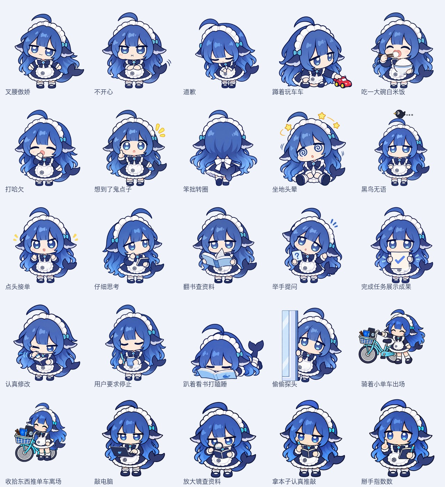

# Big Fat Fish at GPT 🐟

[简体中文](README.md) · **English**

**A Codex desktop pet plugin for macOS, paired with its own floating companion app.** It runs independently of the official Pets plugin and can be used alongside it. It does not replace your selected official pet or take its place in the official Pets selector. This is a community project, not an official OpenAI plugin.

Big Fat Fish has come to work in your Codex to earn a bowl of rice. Wearing a GPT apron with the ChatGPT logo, it is ready to be your desktop coworker. It takes its tasks seriously—and keeps an eye on lunchtime. It thinks, reads, presents its work, and occasionally strikes a proud pose. Between tasks, it plays with a toy car, eats, or lets a little black bird fly overhead.



## What it does

- **Keeps you company in Codex**: expressive animations respond to tasks being accepted, work in progress, requests for input, completion, and corrections.
- **Lives on your desktop**: floats above ordinary windows, with dragging, resizing, and an option to hide it whenever you like.
- **Brings messages closer**: a small bell signals unread messages, and reply summaries appear in white thought bubbles with blue outlines.
- **Helps you continue the conversation**: open a reply composer from the bubble, or double-click the pet to return to Codex.
- **Has a life between tasks**: eating, toy cars, peeking, yawning, and more—21 animations in total.

## Ask Codex to install it

Copy this prompt into a **local Codex chat on your Mac**:

```text
Please install the “Big Fat Fish at GPT” Codex plugin:
https://github.com/Knox-zki/fat-fish-at-gpt

Read the project documentation and download it into a separate directory.
Build and install the companion app at ~/Applications/DSLPet.app, then register
this project's plugin marketplace and install dsl-pet.
Preserve my official Pets plugin, selected pet, and all other plugin settings.
Launch the pet, check that the plugin can communicate with it, and tell me
whether I need to reload Codex.
```

Requires **macOS 13 or later**, and has been verified on Apple Silicon. Installation needs Python 3 and Xcode Command Line Tools; Codex can check your environment and guide you through preparation. The app currently builds from source and has not been notarized by Apple. Windows and Linux are not supported.

Installation may be unavailable if your Codex client does not support local plugin marketplaces. Ask Codex to explain any missing support. After reloading the plugin or reopening your chat, you can say:

```text
Use Big Fat Fish to accompany me during the next tasks. Update its animations
at important task transitions, and show a message bubble when work is complete
or you need my reply.
```

## A few tips

Click the pet to interact, drag it to move it, or use the right-click menu to resize it, preview animations, and read messages. Double-click to return to Codex.

Click a message bubble to turn the page, then click again after the last page to close it. Right-click also closes it. The reply icon opens a composer; direct reply works only with the associated local Codex conversation and remains experimental.

Task states and message summaries are explicitly sent by the plugin at important transitions. **It does not automatically monitor every chat.** Voice input is not currently available. You can continue using the official Pets plugin as usual.

## Want to build it yourself?

See the [development notes](apps/dsl-pet/README.md). The assets are bundled independently with the project. The installed pet does not need the original asset library, a local language model, or an image generation service.

## Code and asset rights

**Source code is licensed under the [MIT License](LICENSE). No license is granted for the visual assets.**

Character designs, images, animations, logos, and other visual assets are excluded from the MIT license. Public display does not grant permission to use or redistribute them. Third-party names and marks belong to their respective rights holders.

**If any material infringes third-party rights, please contact me.** Use [Issues](https://github.com/Knox-zki/fat-fish-at-gpt/issues) or the contact information on my [GitHub profile](https://github.com/Knox-zki). See [ASSET_RIGHTS.md](ASSET_RIGHTS.md) for the full statement.
